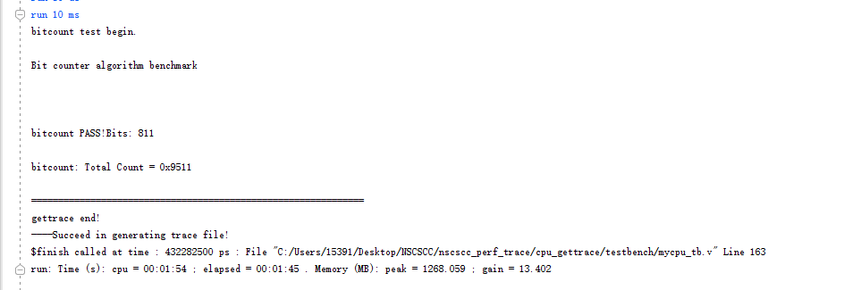
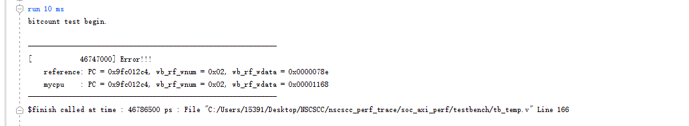
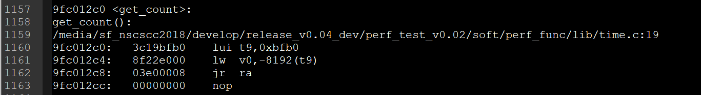

# NSCSCC PERF TRACE

> 龙芯杯性能测试 trace 对比机制

## 目录结构

|- cpu_gettrace  trace 生成代码，使用的 CPU 为国科大2019参赛作品

|- img 说明截图

|- soc_axi_perf 性能测试 CPU 源码，即待测试 CPU 所在目录，同官方发布包，需自己添加

|- soft 性能测试用例

|- README.md 本文档

|- tb_temp.v 修改过的仿真文件，需替换你的 CPU 的仿真文件

|- .gitignore gitignore 文件

## 使用说明

在 debug 方面，官方给出了一个 trace 机制来降低我们查错的难度，有了这个东西之后 debug 是十分简单的，但是官方的 trace 对比机制只适用于功能测试，并不适用于性能测试。因此，此仓库基于一个已经通过性能测试的 CPU （2019年国科大参赛作品），并且是 axi 接口的，以此作为基准搭建了一个性能测试的 trace 对比环境。

之所以没有使用龙芯 cpu132 来构建是因为 cpu132 是 sram 接口的，而性能测试的接口是 axi。

需要指出的是，**性能测试中会有随机因素的引入，导致每个 CPU 跑起来之后一些指令对寄存器的读写结果是不同的，并且可能有指令执行顺序不一样的情况**，因此性能测试的 trace 对比机制并没有给出。而这个随机因素主要是因为每个 CPU 的性能是不一样的，导致 CPU 在访问地址 `0xbfafe000` 时所得到的结果不同，这个地址是一个计数器 TIMER，性能测试的分数主要就是根据这个 TIMER 在程序运行前后的差值来计算的。同时这个 TIMER 还具有提供随机种子等相关功能。具体可参见 `confreg.v` 代码。

### trace 文件生成

本仓库已经生成好了10个性能测试用例的 trace 文件，具体参见 `cpu_gettrace` 目录。不需要重新生成可跳过此步。

如果想重新生成 trace 文件，按如下步骤操作：

1. 使用 vivado2018.3 打开 `cpu_gettrace` 目录下的 vivado 工程。

2. 根据你需要运行的性能测试用例，修改 `axi_ram` 的 coe 配置文件。如运行 bitcount 测试用例，将 `axi_ram` 的 coe 配置文件修改为 `soft` 目录下的 `perf_func/obj/bitcount/axi_ram.coe`。

3. 修改 `mycpu_tb.v` 中的 `TRACE_REF_FILE` 路径（35行），即 trace 文件的保存路径，如运行 bitcount 测试用例，则改为 `golden_trace.txt`。

4. 然后 Run Behavioral Simulation 即可。

运行 bitcount 结果如下图：



### 测试 CPU 代码

待测试 CPU 代码是位于 `soc_axi_perf` 目录下，此处的代码即为性能测试的源码，在使用 trace 对比时需要将测试文件替换为 `tb_temp.v` 的内容，建议在 `soc_axi_perf/testbench` 目录下新建一个测试文件，然后将 `tb_temp.v` 的内容复制进去作为新的仿真文件。如果要覆盖原始的 `mycpu_tb.v` 请将原始代码备份。

需要注意的是，根据你要测试的性能测试用例，需要更改此处的 `axi_ram` 的 coe 配置文件，同时更改 `tb_temp.v` 中的 `TRACE_REF_FILE` 路径。

之后将 `tb_temp.v` set as top，然后 Run Behavioral Simulation 即可。

在自动比对的过程中，如果你的 CPU 执行情况（即写寄存器堆）与 trace 不同即会报错，如下：



此时，可以看到是执行到 `PC = 0x9fc012c4` 时出错，而出错的原因是因为写回寄存器的数据不对。查看软件汇编源码：



可以看到 `PC = 0x9fc012c4` 时是加载 `0xbfafe000` 这个地址的数据，而这个地址即是外设 TIMER 的地址。因此可以知道此处报错是由于上文所提到的随机因素导致的，并不是我们的 CPU 本身出错。此时可以继续运行。

那么该如何判断是否是这个随机因素导致的错误？可以在出错时观察出错的 PC 和写回的数据，一般来说，如果是随机因素导致，PC 一般是相同的而写回数据是不同的，这时在根据汇编源码，查看此处 PC 是否是跟 TIMER 访问相关的 PC，如果是即说明这个出错是随机因素导致，而不是 CPU 本身 bug。

一般来说，性能测试用例只有在程序的开始和最后才会访问 TIMER，在程序的主体是没有的，所以，当出错时需要观察 PC 是否是程序主体部分，如果是需要着重查看。当程序运行在开始和最后时出错，说明出错并不是主体测试程序，一般就是因为随机因素导致的。当有 `xxx PASS!` 输出就说明主体测试程序通过。

当主体测试程序通过后，可以考虑把 trace 关掉，然后运行看是否通过。

## 消除随机因素影响

上面说到，这个随机因素会干扰到这个自动化对比的过程，很多时候是指令执行没有问题但因为随机因素导致运行中断。有没有什么方法可以解决这个问题？肯定是有的。

### 方法1（不建议）
修改软件部分，即将软件部分与 TIMER 相关的代码都注释掉。这样指令在运行时就不会有随机因素参与。

但是不建议这种方式：因为软件部分工程量较大，不一定改得好。

### 方法2（建议）

修改硬件部分，即修改外设 `confreg.v` 代码，因为随机因素的引入是 TIMER 导致，那就可以修改 TIMER 部分代码来消除随机因素。

外设 TIMER 部分代码如下：
```
//-------------------------------{timer}begin----------------------------//
reg         write_timer_begin,write_timer_begin_r1, write_timer_begin_r2,write_timer_begin_r3;
reg         write_timer_end_r1, write_timer_end_r2;
reg  [31:0] conf_wdata_r, conf_wdata_r1,conf_wdata_r2;

reg  [31:0] timer_r1;
reg  [31:0] timer;

wire write_timer = conf_we & (conf_addr[15:0]==`TIMER_ADDR);
always @(posedge aclk)
begin
    if (!aresetn)
    begin
        write_timer_begin <= 1'b0;
    end 
    else if (write_timer)
    begin
        write_timer_begin <= 1'b1;
        conf_wdata_r      <= conf_wdata;
    end 
    else if (write_timer_end_r2)
    begin
        write_timer_begin <= 1'b0;
    end 

    write_timer_end_r1 <= write_timer_begin_r2;
    write_timer_end_r2 <= write_timer_end_r1;
end

always @(posedge timer_clk)
begin
    write_timer_begin_r1 <= write_timer_begin;
    write_timer_begin_r2 <= write_timer_begin_r1;
    write_timer_begin_r3 <= write_timer_begin_r2;
    conf_wdata_r1        <= conf_wdata_r;
    conf_wdata_r2        <= conf_wdata_r1;

    if(!aresetn)
    begin
        timer <= 32'd0;
    end
    else if (write_timer_begin_r2 && !write_timer_begin_r3)
    begin
        timer <= conf_wdata_r2[31:0];
    end
    else
    begin
        timer <= timer + 1'b1;
    end
end

always @(posedge aclk)
begin
    timer_r1 <= timer;
    timer_r2 <= timer_r1;
end
```

通过这个代码可以知道，TIMER 就是一个计数器，每一个 time_clk 就加1，外设在读 TIMER 时返回的是 timer_r2 的值（看读外设部分代码），那么我们可以将 TIMER 的值改为一个定值，即让 TIMER 不再改变，这样就不会因为 CPU 性能不同而导致随机因素的引入。注意若要修改，则 tarce 里的代码和你的 CPU 代码都需修改，且 TIMER 值（建议设置一个相对复杂的数）要相同，同时在测试完备之后注意将代码改为原来的代码。

**以上两种方式都 没有 进行验证，只是提供了两种思路，有兴趣可以试一试**

## 关于 Cache 调试

一般来说，做到性能测试时，说明功能测试都过了。并且，在不加 Cache 的情况下，功能测试能过，那么性能测试一般也能过。但是如果加了 Cache 就不一定了，因为功能测试的大部分代码和数据是在 Kseg1，固定为 Uncache，即不通过 Cache，那就没办法测试 Cache 的正确性，但是性能测试是在 Kseg0 的，会用到 Cache，因此关于 Cache 的调试，也就放在了性能测试里。即加了 Cache 的 CPU 如果能通过性能测试，那么 Cache 也就没有太大问题。


